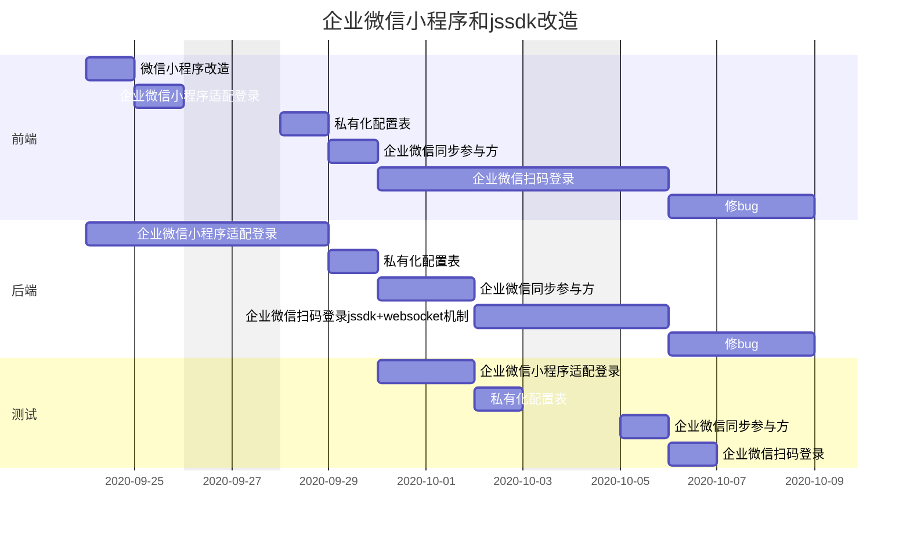

title: 企业微信小程序开发的方案
speaker: icebreakre
js:
    - <https://echarts.cdn.apache.org/zh/asset/theme/infographic.js>
plugins:
    - echarts: {theme: infographic}
    - mermaid
    - katex

<slide class="bg-black-blue aligncenter" image="https://cn.bing.com/az/hprichbg/rb/RainierDawn_EN-AU3730494945_1920x1080.jpg .dark">

# 企业微信小程序私有化方案{.text-landing.text-shadow}

---

* 1.**微信小程序迁移方案(低)**{.bounceIn}
* 2.**企业微信直接挂载小程序 (中)**{.bounceIn}
* 3.**成为企业微信的第三方服务商 (高)**{.bounceIn}
  {.build}
<slide class="bg-black-blue aligncenter" >

---

## 前言

---

企业微信小程序和微信小程序公用一个平台进行发布在线上运行同一套代码，所以在编译时打出不同版本的小程序包的方案  **(不可行)** {.text-intro}

由于企业微信的限制，它在个人信息部分只提供了用户的 userid，姓名和性别，所以按照原先拿手机号登录的方式  **(不可行)** {.text-intro}

企业微信有专门的登录 api 和单独的 jscode2session 机制，原先小程序的方案部分代码可以复用，但是 openid 机制会完全失效 {.text-intro}

---

<slide class="bg-black-blue aligncenter" image="https://cn.bing.com/az/hprichbg/rb/RainierDawn_EN-AU3730494945_1920x1080.jpg .dark">

### 微信小程序迁移方案

---

用户先使用微信小程序，后通过技术手段和企业微信关联，并完成数据迁移{.text-intro}

用户直接使用微信小程序几乎 0 成本，在企业微信迁移时，在我们获取全员的 userid 后，对系统内此公司数据进行迁移，即股加加系统内的 profile 要和企业微信的公司 crop id 和 人员里的 userid 进行一一绑定。{.text-intro}

此迁移方案需要对方授权 密钥 或对方开发人员写接口来返回 access_token 用来获取部门成员的详情{.text-intro}

<slide class="bg-black-blue aligncenter" image="https://cn.bing.com/az/hprichbg/rb/RainierDawn_EN-AU3730494945_1920x1080.jpg .dark">

### 步骤一 ：微信小程序迁移方案

----

:::column

#### 优势

 

* 直接上手用，过渡方案{.aligncenter}

---

#### 缺点

 

- 后续开发无可避免{.aligncenter}
- 数据迁移麻烦{.aligncenter}
- 需要对方相关人员 **重度** 参与{.aligncenter}

<slide class="bg-black-blue aligncenter" image="https://cn.bing.com/az/hprichbg/rb/RainierDawn_EN-AU3730494945_1920x1080.jpg .dark">

## 步骤二 关联企业微信

对方企业微信管理员做小程序关联，把我们的小程序加载进去，我们小程序成为一个他们的内部小程序

此方案需要我们开发一下几点：

- 微信小程序兼容企业微信的登录授权机制改造
- 系统维护一个私有化部署的公司配置的表
   例如(企业微信公司 id，公司名，公司系统对应的 url，等配置信息)，用来在小程序刚开始加载时做系统和数据方面的归属
- 小程序开发部分新页面，用来配合企业微信的登录（企业微信小程序没有授权机制，我们只需要一个页面，默认一直在 loading，load 好进系统就行）
- 如对方直接提供对方企业微信的 cropid 和 screct，我们还需要开发企业微信的授权机制，如对方不提供，对方需要自己开发，并和我们对接 授权登录的机制
- 系统需要兼容用企业微信公司 id 加 userid，加授权 token 的登录机制

<slide class="bg-black-blue aligncenter" image="https://cn.bing.com/az/hprichbg/rb/RainierDawn_EN-AU3730494945_1920x1080.jpg .dark">

### 关联企业微信

----
:::column

优势：

- 可作为一种通用的私有化小程序方案{.aligncenter}

---

缺点:

- 开发无可避免,工作量较大，比较麻烦{.aligncenter}
- 需要对方相关人员 **重度** 参与{.aligncenter}

<slide class="bg-black-blue aligncenter" image="https://cn.bing.com/az/hprichbg/rb/RainierDawn_EN-AU3730494945_1920x1080.jpg .dark">

## 步骤三 成为企业微信第三方服务商

---

这个方案是开发量最多，最麻烦的，
除了步骤二的那些都要开发完成之外，
我们还需要处理应用市场里的各种回调，
比如安装完成回调，数据回调，指令回调等等

在安装完成之后，会获得一个授权码，保存后，用这个授权码和对应公司的 id 等等来直接获取 access_token，这样对方需要参与的部分就会变得非常少。
<slide class="bg-black-blue aligncenter" image="https://cn.bing.com/az/hprichbg/rb/RainierDawn_EN-AU3730494945_1920x1080.jpg .dark">

### 成为企业微信第三方服务商

---
:::column

优势：

- 完全作为一种通用方案，上架到企业微信第三方应用市场，后续做私有化部署成本低{.aligncenter}
- (只需要让对方企业微信管理员，添加这个 app 后，把我们部署好的系统的 url 配置给我们就行，当然普通企业默认安装，数据直接进入我们线上系统，也可以使用){.aligncenter}
- 需要对方相关人员 **轻度** 参与{.aligncenter}

---
缺点:

- 开发非常麻烦，所有的回调交给自己处理{.aligncenter}

<slide :class="size-50" >

### 目前选择的方案为 先过渡后关联 或者直接关联

#### 工时Table

| 功能点                              | 前端(天) | 后端(天) |
| :---------------------------------- | :------: | -------: |
| 微信小程序改造                      |    1     |        0 |
| 企业微信小程序适配qy.login登录      |    1     |        3 |
| 企业微信私有化部署公司基础配置表    |    1     |        1 |
| 企业微信同步参与方                  |    1     |        2 |
| 企业微信扫码登录jssdk+websocket机制 |    4     |        2 |

以上不包含测试和对接的时间：

总时间大约为：9/0.64 = **14**个工作日天 = **16**个天

<slide :class="size-80" >

